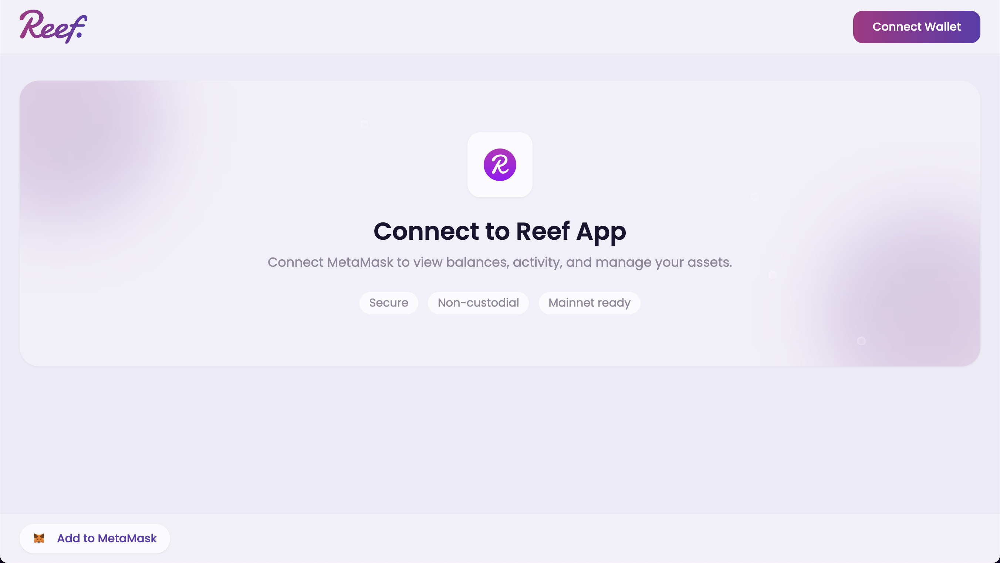
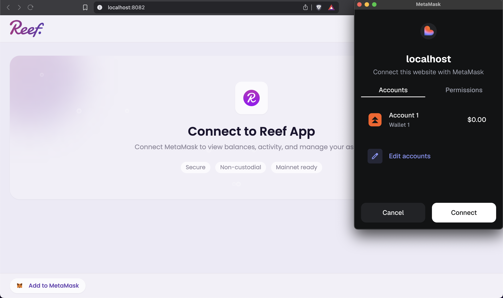
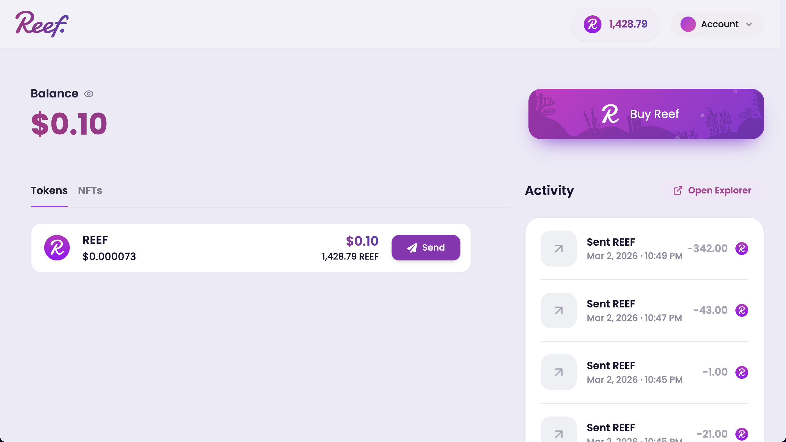
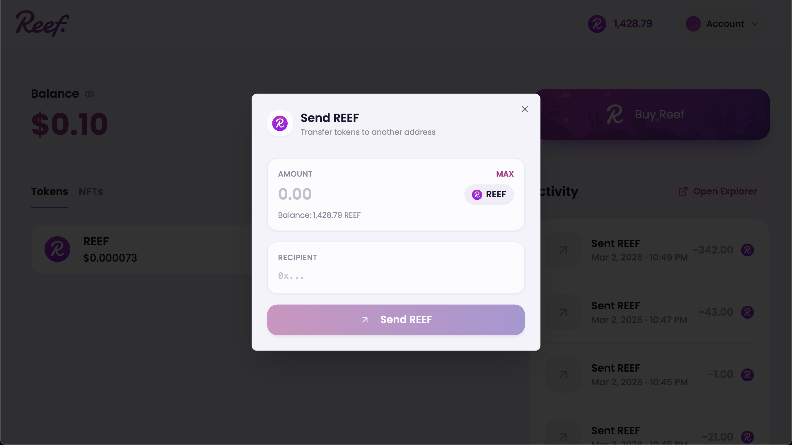
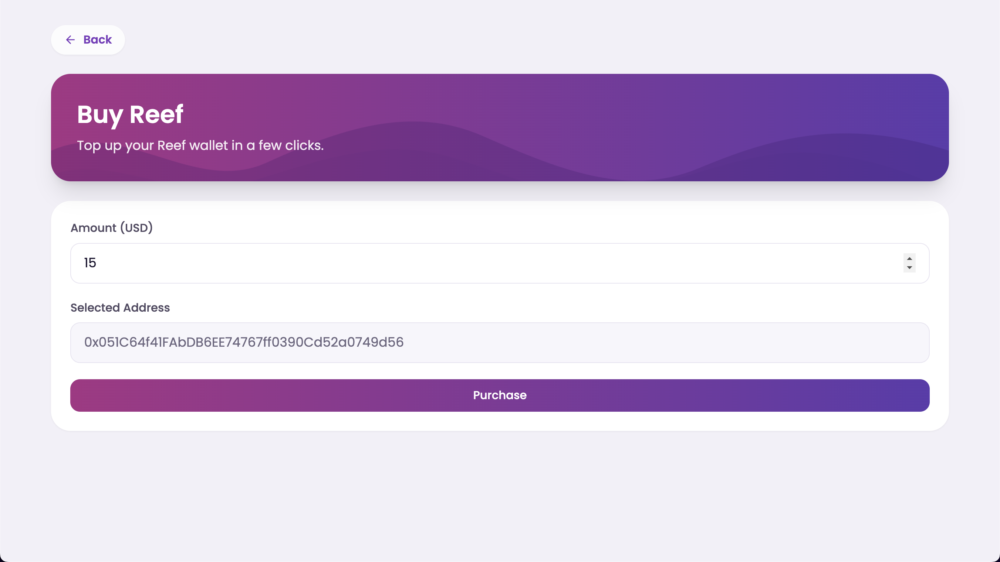

# Reef EVM App

Reef wallet-style React app for viewing REEF balances, activity, and sending transactions with MetaMask.

## UI Overview

### Disconnected state



When no wallet is connected, the app shows a clean onboarding view with:

- Header with Reef logo and `Connect Wallet` CTA.
- Center card with `Connect to Reef App`.
- Context text for balances, activity, and asset management.
- Trust chips: `Secure`, `Non-custodial`, and `Mainnet ready`.
- Bottom-left shortcut: `Add to MetaMask`.

### MetaMask connect approval



Clicking `Connect Wallet` opens MetaMask account permission for the current host (`localhost` in local development). After approval, the app hydrates balances and activity and moves into the connected wallet view.

### Connected dashboard



Once connected, the dashboard provides:

- Top-right REEF balance pill and account menu.
- Fiat balance summary panel.
- `Tokens / NFTs` tabs with REEF holdings.
- `Send` action from the token row.
- Right-side activity feed with recent transfers.
- `Open Explorer` mapped to the active network explorer.
- `Buy Reef` quick-access card.

### Send REEF modal



From the token row `Send` action, the modal opens with:

- Amount input with `MAX` shortcut and live balance hint.
- Recipient input for EVM address (`0x...`).
- Main submit action: `Send REEF`.
- Background dimming while preserving dashboard context.

### Buy REEF page



The buy screen includes:

- Back navigation.
- Hero card (`Buy Reef`) with animated SVG wave decoration.
- Amount input in USD.
- Selected wallet address field.
- `Purchase` action that initiates the on-ramp flow.

## Stack

- Vite
- React + TypeScript
- Tailwind CSS + shadcn/ui
- `wagmi` / `viem`
- `reef-evm-util-lib`
- `@reef-chain/ui-kit`

## Prerequisites

- Node.js 18+
- npm
- A running Reef EVM RPC endpoint (default: `http://localhost:8545`)

## Local development

```bash
npm install
npm run dev
```

Vite runs on `http://localhost:8080`.

## Environment

Create a `.env` file if you want a non-default RPC target:

```bash
VITE_REEF_RPC_URL=/api/reef-rpc
```

Notes:
- Default behavior uses `VITE_REEF_RPC_URL=/api/reef-rpc`.
- In dev, Vite proxies `/api/reef-rpc` to `http://localhost:8545` to avoid browser CORS issues.

## RPC and explorer behavior

- Balance and wagmi read transport use `VITE_REEF_RPC_URL` (default `/api/reef-rpc`).
- Explorer links are dynamic and resolved from the active network in `reef-evm-util-lib` (`getNetwork().blockExplorerUrl` / `network$`), not hardcoded to Reefscan.
- Network defaults to local development (`localhost`) when available.
- Network switching triggers a full app reload so balances, activity, and tabs rehydrate consistently on the selected chain.

## Notifications

Reef actions use UI kit notifications (`UiKit.notify.success/info/danger`) for transaction/copy feedback.

## Scripts

```bash
npm run dev
npm run build
npm run preview
npm run lint
npm run test
```
